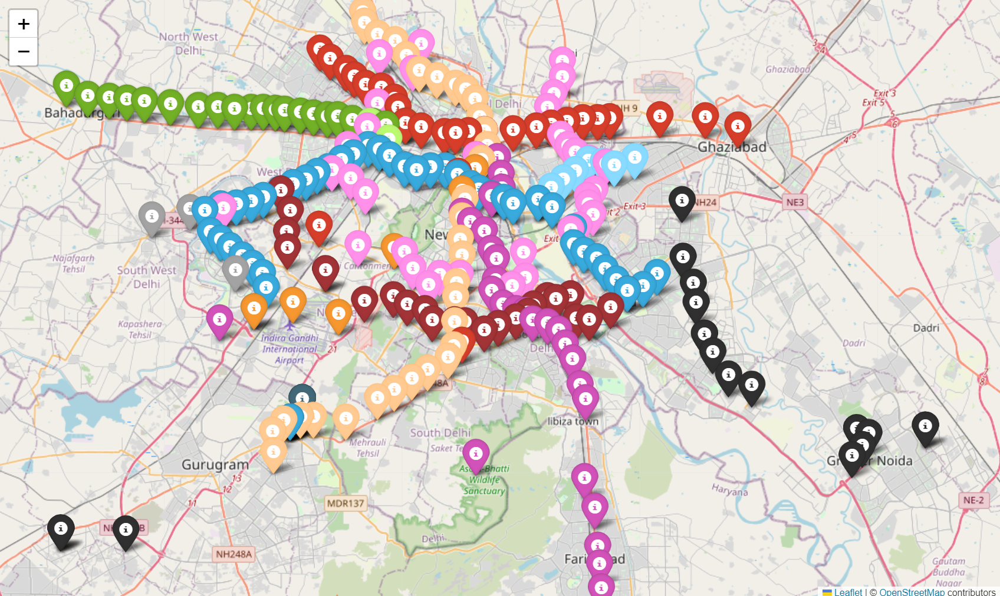
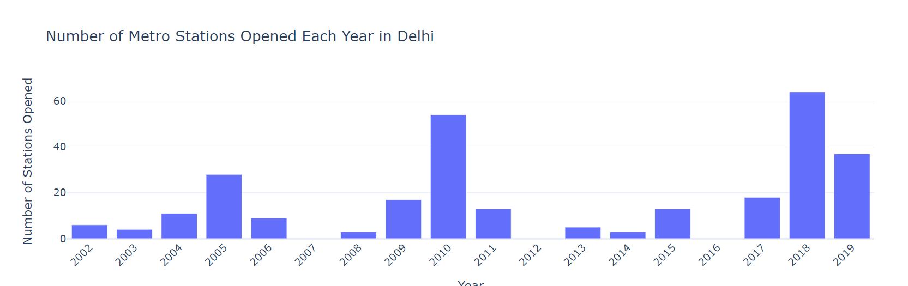
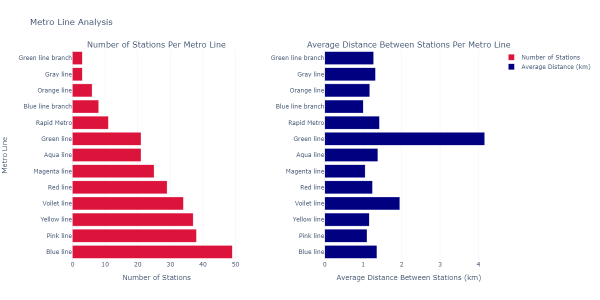
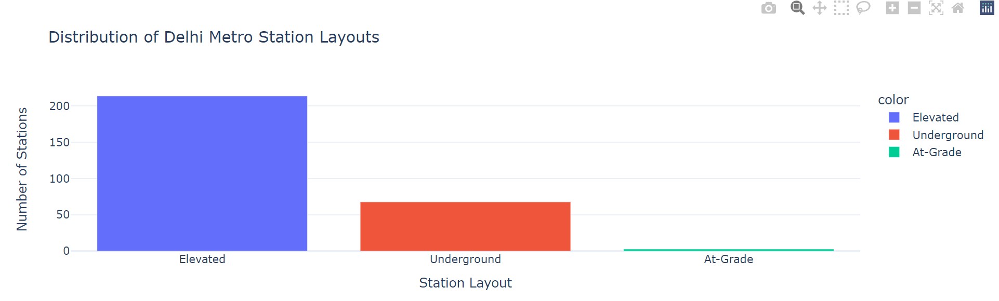
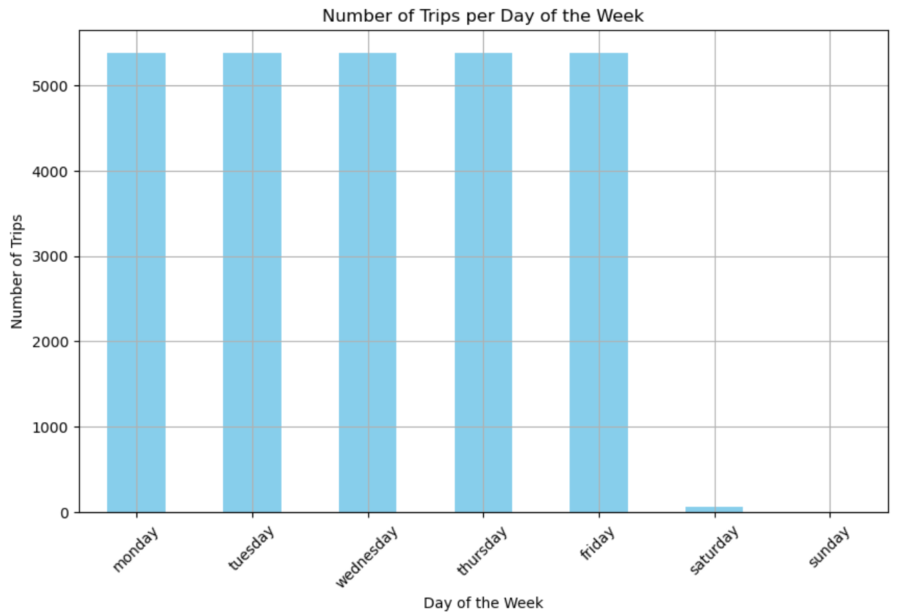
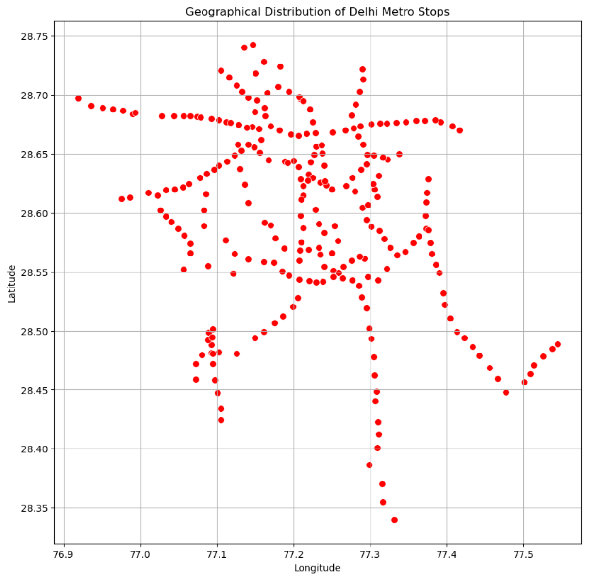
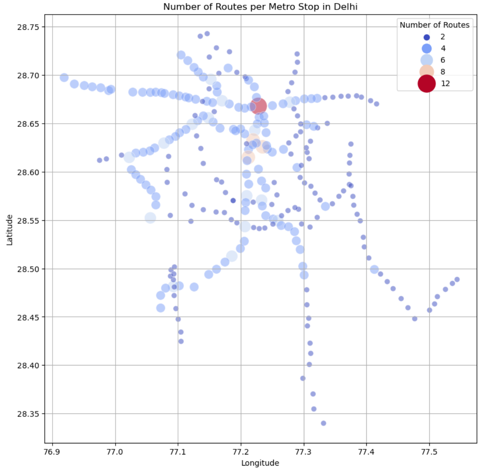

# Optimizing-Delhi-Metro-Operations
Optimize train frequencies to reduce overcrowding and improve commuter experience.

# 🚇 Delhi Metro Network Analysis using Python

This repository contains an in-depth analysis of the **Delhi Metro Network**, focusing on its structure, efficiency, and operational effectiveness. The project examines metro routes, stations, passenger traffic, connectivity, and more. Using Python, we analyze various aspects of the network to identify bottlenecks, optimize routes, and enhance passenger flow, providing valuable insights for urban planning and operational improvements.

## Table of Contents
1. [Introduction](#introduction)
2. [Process](#process)
3. [Dataset](#dataset)
4. [Metro Network Analysis](#metro-network-analysis)
5. [Visualizations](#visualizations)
    1. [Geospatial Visualization](#geospatial-visualization)
    2. [Temporal Analysis](#temporal-analysis)
    3. [Line Analysis](#line-analysis)
    4. [Station Layout Analysis](#station-layout-analysis)
6. [Installation](#installation)
7. [Usage](#usage)
8. [Conclusion](#conclusion)

## Introduction

**Metro Network Analysis** involves examining the metro system to understand its structure, efficiency, and operational performance. By analyzing routes, stations, traffic patterns, connectivity, and other operational aspects, we can gain insights into optimizing metro operations, reducing congestion, improving passenger flow, and enhancing commuter satisfaction.

This project focuses on **Delhi Metro Network Analysis** using Python. The goal is to leverage available datasets to identify key areas where train frequencies can be adjusted to better match demand across various routes and times of the day.

## Process

Here’s the process followed for **Delhi Metro Network Analysis**:
1. **Define Objectives**: Determine goals such as optimizing routes, reducing congestion, improving passenger flow, or understanding travel patterns.
2. **Collect Data**: Compile data on metro lines, stations, connections, and transit schedules.
3. **Clean Data**: Ensure data quality by addressing inconsistencies, missing values, or errors.
4. **Visual Representation**: Create visualizations like route maps, congestion heatmaps, and passenger flow charts.
5. **Analyze**: Evaluate how effectively the network handles passenger traffic and meets operational targets.

## Dataset

We used a dataset that includes:
- **Station Names**
- **Distance from Starting Point (km)**
- **Latitude and Longitude Coordinates**
- **Opening Dates**
- **Station Layouts (Elevated, Underground, At-Grade)**
- **Metro Line Information**

### Sample Data
```
Station ID, Station Name, Distance from Start (km), Line, Opening Date, Station Layout, Latitude, Longitude
1, Jhil Mil, 10.3, Red Line, 2008-04-06, Elevated, 28.675790, 77.312390
```

## Metro Network Analysis

We followed a structured analysis for the **Delhi Metro Network** using Python libraries like `pandas`, `folium`, and `plotly` for data analysis and visualization. Below is the code snippet used to read and explore the dataset:

```python
import pandas as pd
import folium
import plotly.express as px
import plotly.graph_objects as go
from plotly.subplots import make_subplots
import plotly.io as pio

pio.templates.default = "plotly_white"
metro_data = pd.read_csv("Delhi Metro Network.csv")

# Sample check of the dataset
print(metro_data.head())
```

Key steps include:
1. **Loading the data** and examining the structure.
2. **Checking for missing values** and ensuring data integrity.
3. **Performing geospatial analysis** to map out the locations of stations.
4. **Analyzing the temporal expansion** of the network over the years.
5. **Studying individual lines** for station count and average distance.

## Visualizations

### Geospatial Visualization

This map visualizes the **Delhi Metro Stations** across the city. Each marker represents a station, color-coded based on the metro line it belongs to. This visualization helps to understand the geographical distribution and connectivity of the network.



### Temporal Analysis

The number of stations opened per year is analyzed to understand the pace and phases of the **Delhi Metro’s expansion**.



### Line Analysis

This analysis compares the **number of stations** and **average distance between stations** for each metro line. The goal is to identify which lines are more extensive and denser.



- **Left**: Number of stations on each line.
- **Right**: Average distance between stations on each line.

### Station Layout Analysis

This visualization displays the distribution of station layouts, categorized into **Elevated**, **Underground**, and **At-Grade** stations. Understanding the station layout helps in planning future infrastructure.



### Additional Visualizations

We analyzed the **number of trips during different time intervals**, **route complexity**, and **passenger flow** to further understand the operational efficiency of the Delhi Metro. Below are a few additional plots:

#### Number of Trips per Day of the Week


#### Geographical Distribution of Stops


#### Number of Routes per Metro Stop


## Installation

To replicate this analysis, you'll need the following Python libraries:

```bash
pip install pandas folium plotly
```

## Usage

1. **Clone this repository**:
   ```bash
   git clone https://github.com/SIddhant-Saini/Optimizing-Delhi-Metro-Operations.git
   ```

2. **Navigate to the project directory**:
   ```bash
   cd delhi-metro-network-analysis
   ```

3. **Run the Jupyter Notebook**:
   ```bash
   jupyter notebook Analysis.ipynb
   ```

4. **Explore the Visualizations**:
   Open the notebook in Jupyter and interact with the various maps and plots.

## Conclusion

The **Delhi Metro Network Analysis** project provides insights into the structure and performance of the metro system. The findings suggest areas for operational improvements, including optimizing train frequencies to match demand, reducing congestion, and improving the overall commuter experience. By leveraging data analysis and visualization, this project showcases how urban transit systems can be enhanced for greater efficiency.

---
